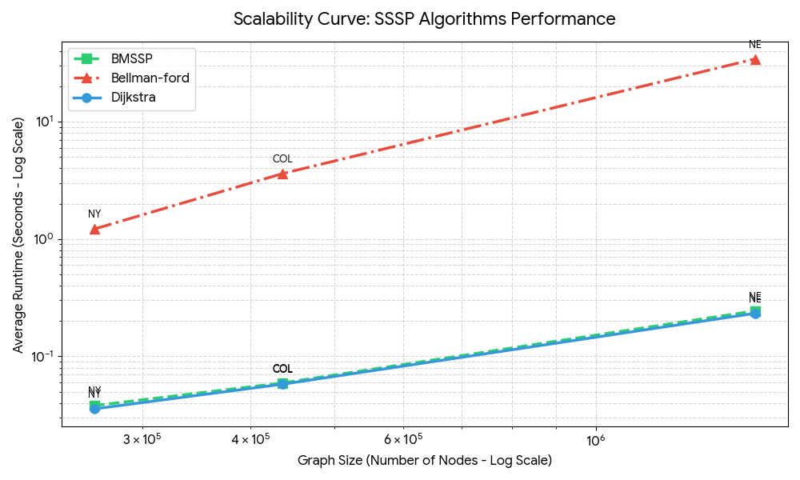
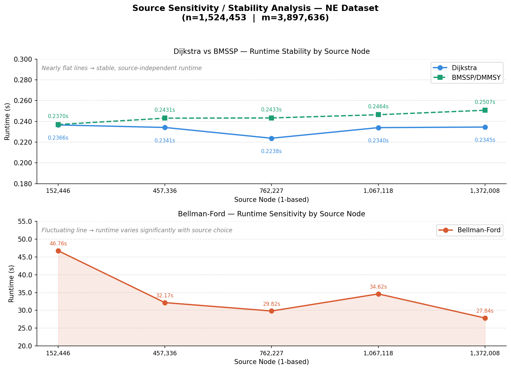

GitHub repon için profesyonel, "Mühendislik Portfolyosu" tadında bir **README.md** hazırladım. Bu metni direkt kopyalayıp GitHub'daki `README.md` dosyanın içine yapıştırabilirsin.

---

```markdown
# Comparative Analysis of SSSP Algorithms: Dijkstra, Bellman-Ford, and BMSSP

This repository features a comprehensive performance benchmark of three Single-Source Shortest Path (SSSP) algorithms on real-world large-scale road networks. The study evaluates **Dijkstra’s Algorithm**, **Bellman-Ford**, and a modern **BMSSP/DMMSY** variant across 135 independent test runs.

## 🚀 Project Overview

The goal of this project is to analyze algorithmic efficiency in terms of **runtime**, **memory consumption**, and **scalability** using directed graph datasets with over 1.5 million nodes.

### Key Highlights:
- **Datasets:** DIMACS Road Networks (NY, COL, NE).
- **Large-Scale Testing:** Up to 1.5M vertices and 3.9M edges.
- **Environment:** WSL (Ubuntu 24.04), C++17 compiled with `-O2` optimization.
- **Precision:** Memory tracking via Linux `getrusage()` and `ru_maxrss`.

## 📊 Key Findings

* **Dijkstra:** Remains the gold standard for road networks, offering the best balance of speed and memory efficiency.
* **Bellman-Ford:** Highly inefficient for large-scale graphs (e.g., **114s** vs **0.23s** on the NE dataset compared to Dijkstra).
* **BMSSP:** Competitive runtime matching Dijkstra, but at a **1.85x higher memory cost** due to auxiliary workspace structures.

## 🛠️ Implementation Details

To ensure a fair and transparent comparison:
- **Custom-built:** Dijkstra and Bellman-Ford were implemented from scratch to ensure precise control over data structures and memory tracking.
- **Adapted:** The BMSSP/DMMSY analysis uses a modified version of the reference implementation to ensure compatibility with our CSR graph structure and modern benchmarking tools.
- **Validation:** All implementations were cross-validated to ensure identical shortest-path distance outputs across all datasets.

## 📂 Repository Structure

```text
├── src/                    # C++ source codes (Dijkstra, Bellman-Ford, BMSSP)
├── reports/                # Final academic analysis report (PDF)
├── results/                # Performance plots (.png) and raw data (.xlsx)
│   ├── Runtime_Comparison.png
│   ├── Memory_Usage.png
│   ├── Scalability_Curve.png
│   ├── Efficiency_Scatter.png
│   └── Source_Stability.png
└── README.md               # Project documentation
```

## 📈 Performance Visuals

### Scalability Analysis
The following curve illustrates how algorithms respond as graph sizes grow from 264K (NY) to 1.5M (NE) nodes.


### Source Stability
This box plot confirms the operational consistency of Dijkstra and BMSSP regardless of the starting node, contrasted with Bellman-Ford's high sensitivity.


## 📄 Full Report
For a detailed discussion on the "Time-Memory Trade-off" and theoretical vs. practical observations, please refer to the [Full Analysis Report](./reports/SSSP_Final_Report.pdf).

## 🔗 References
1. 9th DIMACS Implementation Challenge - Shortest Paths.
2. Duan et al. "Breaking the Sorting Barrier for Directed Single-Source Shortest Paths," STOC 2025.
3. [DMMSY-SSSP Reference Implementation Repository](https://github.com/danalec/DMMSY-SSSP).
